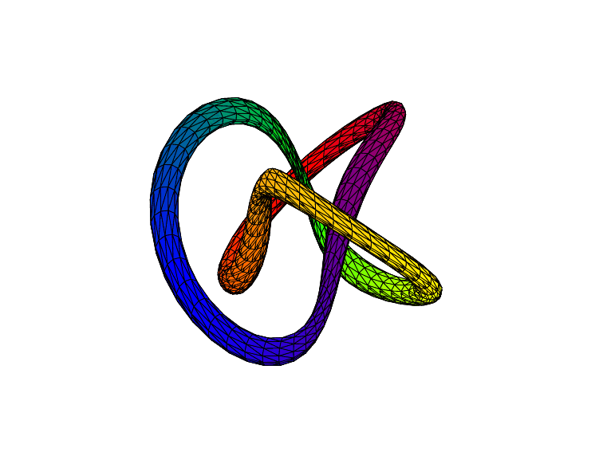

# Ti*k*Z-Animations

A curated showcase of my Ti*k*Z artwork along with the source code and supporting tools.

---

## Selected Animations

A quick look at two of my favorites:

|  *Elliptic Spherical Möbius Transformation* |  *Tre Foil Knot* |
|:---:|:---:|

---

## Repository Structure

- **Animations/**  
  Prebuilt GIFs converted from PDF flip-books via [ezgif.com/maker](https://ezgif.com/maker).  

- **Sources/**  
  LaTeX (plus Lua/Python) source code for chosen animations. (My earliest experiments have been retired.)

- **Packages/**  
  Development files for the custom TikZ package `pline-vec.sty`.

---

## Technical Highlights

### 1. **Pline-Vec Toolkit**
- **True Z-Buffering**  
  Sorts multiple surfaces with robust adjacency sorting.
- **Euler-Angle Rotations**  
  Rotation matrices for both global frames and individual path segments.
- **Plane Intersections**  
  Manual via `spath3`; on-plane drawing with `\pgflowlevelsynccm`.  
  *(Automated intersection sorting still in progress.)*

### 2. **LuaTeX Integration**
Core algorithms are being ported to Lua for speed.

---

## Roadmap

| Deliverable                      | Status                             | ETA               |
|----------------------------------|------------------------------------|-------------------|
| **Package Documentation**        | Not started                        | 1–2 months (from start)        |
| **Parametric Surface Generator** | ✔ Multi-mesh Z-buffer pass done    | —                 |
| **Rotation Matrix Utility**      | ✔ Complete and tested              | —                 |
| **Plane-Segment Sorter**         | Manual via `spath3`                | 2–5 months        |
| **Lua Macro Rewrite**            | Midway through                   | 1–2 months        |
| **Solid Geometry Implementation** | Planning stage                  |  1-2 months        |

> **Total estimated development time:** 4–6 months

---

## License

This work is released under the **MIT No Attribution (MIT-0)** License—use, modify, and distribute freely, no attribution required (though always appreciated). See [MIT-0 License](https://opensource.org/license/mit-0/).
