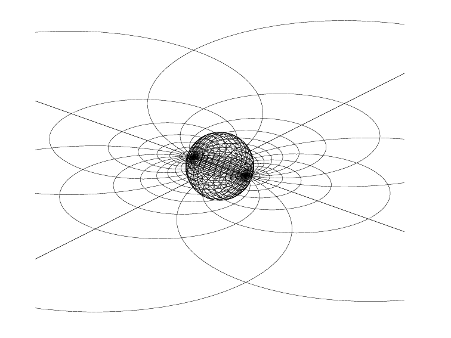

# Ti*k*Z-Animations

## Overview

Welcome to my public repository, Ti*k*Z-Animations. This is a curated 
collection of my artwork in Ti*k*Z, focused mainly on animations,
though I will also include some still diagrams as well.

## Repository Structure

- **Animations/**: Contains `.gif` files of various animations. These 
are generated by compiling $\LaTeX$ documents into `.pdf` 
"flip books", and converting them into `.gif`s using online tools -
I really like https://ezgif.com/maker.

- **Sources/**: Contains the complete source code for *some* of my  animations. I could not include all of them, because as my skills improved, I realized that some of the code was, shall we say, less than ideal.

- **Packages/**: Contains the complete source code for *some* of my 
animations. I could not include all of them, because as my skills 
improved, I realized that some of the code was, shall we say, less
than ideal.

## Featured Animation

*Elliptic Spherical Möbius Transformation*

## Technical Highlights

- **Pline-vec**: Developing `pline-vec.sty` to facilitate 
the drawing of 3D illustrations in Ti*k*Z. For example,
this software will be able to z-buffer multiple surfaces at once, and it will also enable Euler angle rotations of the main reference frame, as well as the ability to use Euler angles inside of a path.

- **AnimateTeX**: I wrote an animation software for $\LaTeX$
using Python. This has the advantage of letting you see the output,
as it is being produced (as opposed to using a for loop in 
$\LaTeX$).

- **Community Contributions**: I enjoy spending my time contributing to
the $\LaTeX$ and Ti*k*Z community on [TeX Stack Exchange](https://tex.stackexchange.com/users/319072/jasper) and [TikZ.net](https://tikz.net/author/jasper/). So much of what I know now is because of the time othes have taken to help me overcome so many issues.

## Personal Background

Beyond academics, I have dedicated over 900 hours to volunteering with animals, and people with disabilities. My experience includes:

- Tube-feeding and caring for squirrels, birds, owls, skunks, and even 
a bald eagle.

- Extensive horse handling and rehabilitation work.

- Many years of providing theraputic services for people who have 
disabilities.

## Future Aspirations

I want to make really engaging math diagrams for math topics in the future. I also want to have the most well illustrated thesis ever!

## Contact

Feel free to reach out via email: [animatetikz@gmail.com](mailto:animatetikz@gmail.com)

## Disclaimer

This repository is licensed under the MIT No Attribution (MIT-0) 
License. You are free to use, modify, and distribute the content without 
any attribution requirements. For more details, refer to the 
[MIT-0 License](https://opensource.org/license/mit-0/).

That being said, I always do appreciate credit, but it is not 
*required*.