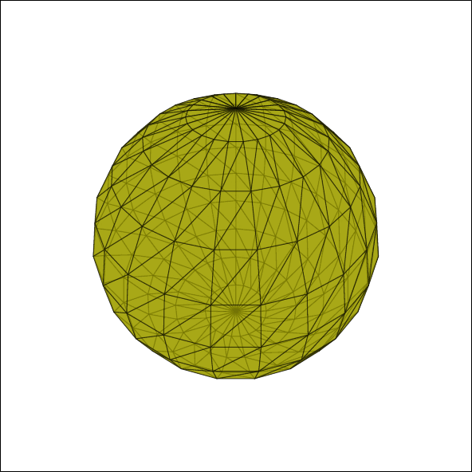
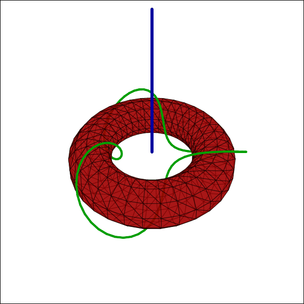

# Ti*k*Z-Animations

**Ti*k*Z-Animations** is my experimental space for creating mathematical and technical animations entirely in TeX. Using **Ti*k*Z**, **Lua**, and **MetaFun**, I explore how far TeX can go beyond static diagrams.  

This isn’t a finished library — it’s a collection of experiments, custom tools, and techniques for 3D geometry, rendering, and animation. You’re welcome to adapt anything you find here.  

See more on [YouTube — Jasper Math Illustrations](https://www.youtube.com/@JasperMathIllustrations).

---

## Examples

Note:  As the author's skills improve and new tooling is used for new illustrations, these illustrations presented here may not have sources available or updated in the repository.  If you would like to see how a particular animation is achieved, contact the author, who will explain the technical details and/or clean up and post the current source code to this repository (which may get taken down if the technology used to animate the particular item is outdated).

<table>
<tr>
<td align="center">
 
<code>Elliptic Spherical Möbius Transformation</code>
</td>
<td align="center">
 
<code>Moving a Sphere Through the Camera</code>
</td>
</tr>
<tr>
<td align="center">
 
<code>Rotation in a Rotated Basis</code>
</td>
<td align="center">
 
<code>Trefoil Knot</code>
</td>
</tr>
</table>
